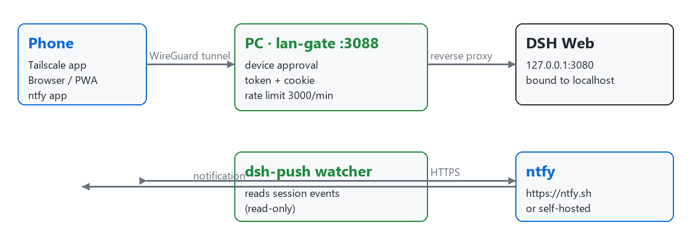

# dsh-mobile-access

[](https://github.com/alexcarterio/dsh-mobile-access/actions/workflows/ci.yml)



Everything you need to use DeepSeek Harness (DSH) from your phone: a secure LAN
gate plugin with device approval, a mobile-friendly layout, phone push
notifications, and PWA installation assets.

The core is a self-contained, dependency-free Cordis plugin (`lan-gate.mjs`)
that exposes your local DSH web UI to trusted LAN / Tailscale devices through a
device-approved, token-bound reverse proxy — plus an optional `dsh-push` helper
that forwards DSH session events to your phone over
[ntfy](https://github.com/binwiederhier/ntfy).

## Features

- **Device approval flow** — a new device sees a "waiting for approval" gate page and cannot reach DSH until you approve it from the desktop.
- **Per-device access mode** — each approved device can be set to `auto`, `phone`, or `desktop`. Phone mode injects a compact layout; desktop mode keeps the desktop layout even in a narrow window.
- **Token + cookie binding** — one approval issues a 128-bit random token that is claimed once and bound to a single browser via an `HttpOnly`/`SameSite=Lax` cookie. Revoking a device drops its access immediately.
- **Rate limiting** — per-IP sliding-window limit (default 3000 requests/minute, raised from the upstream 120), returning `429` on overflow to blunt scanners and brute-force attempts.
- **Mobile layout** — compact phone CSS, full-screen dialogs, non-obscuring model/context menus, iOS focus-zoom prevention, and a `crypto.randomUUID` polyfill for non-HTTPS intranet contexts.
- **Attachment upload** — `POST /lan-gate/upload` accepts files up to 20 MB, saved under `$DSH_HOME/uploads/` with a 7-day automatic cleanup. A companion script [`tools/parse_file.py`](tools/parse_file.py) converts common attachment formats (txt/docx/pdf/zip/7z/rar) to readable text.
- **Phone gallery / camera buttons** — injected floating buttons that reuse the desktop paste path (or fall back to inserting an ``).
- **Admin panel** — an in-app panel under **Settings → LAN Access** to view status, approve/deny devices, switch access modes, revoke devices, and copy access URLs.
- **ntfy phone push (`dsh-push`)** — a standalone watcher that sends a high-priority notification when DSH is waiting for your approval or a reply, and a normal notification when a task turn finishes.

## Security model

The plugin is designed to run only on trusted networks. It does **not** provide end-to-end HTTPS and must **never** be exposed directly to the public internet.

1. **Network layer (firewall)** — allow inbound traffic to the gate port (`3088` by default) only from your LAN or your Tailscale subnet (`100.64.0.0/10`). Everything else stays unreachable.
2. **Application layer (approval + token)** — every new device must be approved on the desktop, then receives a one-time, single-browser-bound token. Revocation cuts the connection.
3. **Host process** — the DSH web server itself stays bound to `127.0.0.1:3080`; only the in-process gate proxy forwards to it. The local-only control routes (`/lan-gate/status`, `/lan-gate/action`, `/lan-gate/upload`) reject non-local requests by checking `x-forwarded-for`.

> **Warning:** do not bind DSH itself to `0.0.0.0` and do not port-forward the gate port to the public internet. Use it only inside a trusted LAN or a Tailscale tailnet.

## Requirements

- **DeepSeek Harness** installed via npm (see the [upstream repo](https://github.com/deepseek-ai/deepseek-harness) for installation). The `web` profile must serve the UI on `127.0.0.1:3080`.
- **Node.js** — whatever version your DSH runs on (the plugin is a single `.mjs` file with no dependencies).
- **Tailscale** (optional, recommended for phone access) — a client on the desktop and on each phone, logged into the same account.
- **ntfy** (optional) — for phone notifications: the [ntfy app](https://ntfy.sh/) on your phone, and Python 3 with the `requests` and `zstandard` packages for `dsh-push`.

## Installation

### 1. Place the plugin

Copy `lan-gate.mjs` into your DSH home:

```text
~/.dsh/lan-gate/lan-gate.mjs
```

(`$DSH_HOME` defaults to `~/.dsh`; set `DSH_HOME` to override it.)

### 2. Register the plugin

Merge the following into `~/.dsh/profiles/web/cordis.patch.yml` (see [`cordis.patch.yml.example`](cordis.patch.yml.example) for the full annotated version):

```yaml
- insert:
    - id: lan-gate
      name: 'file:///C:/Users/<you>/.dsh/lan-gate/lan-gate.mjs'
```

Adjust the `file:///` path to your real, absolute `lan-gate.mjs` location (Windows `file:///C:/...`, macOS/Linux `file:///home/...` or `file:///Users/...`).

### 3. Restart DSH

Restart DSH so the user patch is loaded. On startup the plugin logs:

```text
[lan-gate] listening on 0.0.0.0:3088 -> 127.0.0.1:3080
```

### 4. Open from another device

On a device on the same LAN, visit:

```text
http://<lan-ip>:3088
```

where `<lan-ip>` is this machine's LAN IP. The device shows a "waiting for approval" page until you approve it in **Settings → LAN Access**.

### 5. Parse uploaded attachments (optional)

`tools/parse_file.py` converts a downloaded attachment into readable text (or
extracts an archive):

```text
py tools/parse_file.py <file> [output]
```

- Without `[output]`, it writes `<file>.parsed.txt` and prints the first 500
  characters to stdout.
- Supported: `txt`/`md`/`csv`/`json`/`xml`/`yaml`/`log` and common code files
  (read as text), `docx`, `pdf`, and archives `zip`/`7z`/`rar` (extracted to a
  same-named directory; `rar` needs WinRAR/unrar installed).

Install its optional dependencies once:

```text
pip install python-docx pypdf py7zr rarfile
```

## Configuration

| Environment variable | Default | Description |
|---|---|---|
| `LAN_GATE_PORT` | `3088` | Port the gate proxy listens on. |
| `LAN_GATE_HOST` | `0.0.0.0` | Listen address. Set to `127.0.0.1` when a reverse proxy/tunnel (e.g. `tailscale serve`) sits in front. |

- **Rate limit** — hardcoded to `3000` requests/minute per IP (sliding window). It is intentionally not tunable via env; edit the `RATE_LIMIT_PER_MIN` constant in `lan-gate.mjs` if you must, then restart DSH.
- **Approval state** — persisted at `$DSH_HOME/lan-gate-state.json`. Delete it to reset all approvals.
- **Uploads** — stored at `$DSH_HOME/uploads/`, auto-cleaned after 7 days.

## Phone setup

### 1. Join a tailnet (Tailscale)

1. Install Tailscale on the desktop and on the phone.
2. Log both devices into the **same** Tailscale account.
3. Confirm both appear in the [Tailscale admin console](https://login.tailscale.com/).

Find the desktop's Tailscale IP with:

```text
tailscale ip -4
```

### 2. Open over the tunnel

On the phone (with Tailscale connected), browse to:

```text
http://<machine-tailscale-ip>:3088
```

Approve the phone in **Settings → LAN Access** with access mode **Phone**.

### 3. (Recommended) HTTPS via Tailscale Serve

`tailscale serve` provides a valid TLS certificate so Chrome offers the "Install app" (PWA) flow:

```text
tailscale serve --bg --yes --https=3443 http://127.0.0.1:3088
```

Then open `https://<your-device>.your-tailnet.ts.net:3443` on the phone.

- Inspect: `tailscale serve status`
- Remove: `tailscale serve reset`

### 4. Install as a PWA

With the HTTPS address open in Chrome, use **⋮ → Install app / Add to Home screen**. See [`pwa/pwa-setup.md`](pwa/pwa-setup.md) for how the icon/manifest/service-worker assets are applied to the DSH frontend.

### 5. Phone notifications (ntfy)

`dsh-push` forwards DSH events to your phone via ntfy:

| Environment variable | Description |
|---|---|
| `NTFY_URL` | Push server, default `https://ntfy.sh` (self-hosting supported). |
| `NTFY_TOPIC` | Your topic name — treat it like a secret; never publish it. |
| `NTFY_TOKEN` | Optional ntfy access token. |

Run it (from `dsh-push/`):

```text
py dsh_push.py            # run continuously
py dsh_push.py --test     # send a test notification
```

Or start it as a background process on Windows with [`dsh-push/start_push.bat`](dsh-push/start_push.bat) (uses `%~dp0`, so it works from any location).

Install dependencies once:

```text
pip install requests zstandard
```

Subscribe your phone by opening `https://ntfy.sh/<your-ntfy-topic>` in the ntfy app.

## Limitations

- **No end-to-end HTTPS** — the app layer is plain HTTP inside the WireGuard tunnel; the tunnel itself is the encryption boundary.
- **Depends on the Tailscale control plane** — device discovery relies on the Tailscale coordination service (data path is peer-to-peer). Self-hosted `headscale` is a more advanced alternative.
- **Notifications do not deep-link** — Tailscale domains cannot pass WebAPK App Links verification, so tapping a notification opens the browser rather than the installed app.
- **DSH upgrades may revert PWA changes** — icon/manifest/service-worker edits to the built frontend `dist` need to be re-applied after a DSH upgrade.
- **Same process as DSH** — the plugin runs in-process (no subprocess, no external calls); re-audit after DSH upgrades.

## License

[MIT](LICENSE).

## Credits & References

This project builds on the work of the following projects:

- **hchao3335-maker/dsh-lan-gate** — the `lan-gate.mjs` plugin is derived from
  [hchao3335-maker/dsh-lan-gate](https://github.com/hchao3335-maker/dsh-lan-gate)
  (MIT). This release preserves the upstream MIT license and adds: rate limit
  120 → 3000, attachment upload endpoint, 7-day upload cleanup, phone
  gallery/camera buttons, and menu layout adjustments. See [`NOTICE`](NOTICE).
- **[Leon0555/dsh-lan-access](https://github.com/Leon0555/dsh-lan-access)** — a
  similar solution, reviewed as research reference.
- **[DeepSeek Harness](https://github.com/deepseek-ai/deepseek-harness)** — the
  host platform.
- **[Tailscale](https://github.com/tailscale/tailscale)** — the mesh VPN used
  for secure remote access.
- **[ntfy](https://github.com/binwiederhier/ntfy)** — the push-notification
  service used by `dsh-push`.
